# Applicant Showcase App Report

## 1. Introduction

I approached the Applicant Showcase App from the perspective of a senior Flutter engineer.
This was not the first time I had worked on this assessment. In a previous attempt, I leaned heavily into engineering depth: additional infrastructure, workspace tooling such as Melos, and a more ambitious structure around the app. Technically, that solution had strong ideas, but the feedback was that it was difficult to run and difficult to understand in the evaluation context. I took that feedback seriously for this version.
For this implementation, my goal was different: to deliver a professional, modular, modern Flutter application while staying inside the structure proposed by Symmetry. I intentionally adapted to the existing Clean Architecture rules, folder conventions, and documentation instead of replacing them with my preferred production setup. The result is an app that modernizes the stack and adds substantial functionality without making the project harder for reviewers to inspect, run, or maintain.

## 2. Learning Journey

The main learning journey in this version was not learning Flutter from zero, but calibrating the level of engineering to the problem, the reviewers, and the constraints of the existing codebase. With my background, I could have introduced a larger architecture, a multi-package workspace, stricter automation, or more infrastructure. Instead, I focused on showing senior judgment: improve what matters, preserve what is already established, and avoid making the project harder to evaluate.

The project follows a feature-first Clean Architecture structure where each feature is divided into `data`, `domain`, and `presentation` layers. I used that structure as the boundary for the work. External integrations stayed in data sources, business operations stayed in use cases and repository contracts, and UI behavior stayed in blocs, routes, screens, and widgets. This kept the app aligned with the documentation while still allowing the implementation to become more complete and modular.

The most important technical work was modernizing the app for Dart SDK `^3.11.1` and Flutter `3.41.4`. That required dependency review, Android project regeneration, generated-code updates, package compatibility fixes, and a careful migration away from obsolete pieces of the stack. I also adopted [Conventional Commits](https://www.conventionalcommits.org/en/v1.0.0/) to make the implementation history easier to read and review.

Several areas received focused improvements:

- **Drift** for local persistence, replacing Floor because Floor was obsolete for the current dependency and SDK targets.
- **Firebase Authentication** and Google Sign-In for authenticated user flows.
- **Firestore and Firebase Storage** for community articles and uploaded article images.
- **`go_router`** for modular routing, guarded routes, shell navigation, and redirect flows.
- **`flutter_hooks`** to reduce unnecessary widget rebuilds and make controller lifecycle management cleaner.
- **Flutter `gen-l10n`** for generated localization support.
- **Bloc testing, widget testing, unit testing, and integration testing** to validate the bookmarks feature and shared UI behavior.

The project documentation, especially the architecture and coding guidelines, was the main reference point for implementation decisions. I treated those rules as part of the product requirement: the app needed to be stronger, but it also needed to remain recognizable as the codebase Symmetry asked applicants to work with.

## 3. Challenges Faced

The first major challenge was choosing restraint. With a senior background, it is easy to solve an assessment by bringing in a full production toolkit. My previous version of this test went in that direction and included more infrastructure than the reviewers needed. For this version, I deliberately optimized for clarity, maintainability, and reviewer confidence. I kept the project inside the proposed structure while still improving the architecture and feature set.

The second major challenge was dependency modernization. Updating the project to be compatible with Dart SDK `^3.11.1` and Flutter `3.41.4` affected multiple parts of the app, including generated code, Android setup, Firebase packages, local persistence, and test dependencies. I handled this by upgrading dependencies carefully and keeping the architecture stable while making compatibility fixes.

Another challenge was regenerating the Android folder for compatibility with the latest Flutter tooling. This was necessary to avoid carrying outdated Android project files into a modern Flutter build. I also added improvements aimed at increasing Android build performance, reducing friction during development and validation.

Migrating from Floor to Drift was also significant. Floor had become a risk because of compatibility and maintenance concerns, so Drift was added as the local database solution. This migration required preserving the bookmarks behavior while adapting the local data source and generated database layer.

Routing and authentication created another layer of complexity. The app needed advanced modular routing with route guards, auth-aware redirects, preserved navigation intent, and a smooth transition between signed-in, signed-out, and guest paths. I addressed this by keeping routing concerns in the router layer and authentication behavior behind the auth feature boundaries.

Localized error handling was another important area. Instead of showing generic or hardcoded errors, the app now has a more exhaustive error handling approach with localization support. This makes failures easier for users to understand and keeps UI copy consistent across locales.

Finally, community articles added several cross-cutting concerns: Firestore documents, Firebase Storage images, ownership checks, editing, deletion, bookmarks, and rich article content. The main lesson here was to keep provider-specific details out of the presentation layer and isolate Firebase behavior in the data layer.

## 4. Reflection and Future Directions

Overall, this project became an exercise in senior-level adaptation. The technical part was important, but the real value was delivering a strong solution within the evaluator's context. I avoided over-customizing the foundation, respected the existing Clean Architecture rules, and still added modernization, authentication, localization, routing, persistence, community content, tests, and performance-related improvements.

This version reflects how I would work inside a team that already has standards: understand the rules, improve the implementation, and leave the system easier for the next developer to understand. I believe that is especially important in an assessment, because the best solution is not only the one with the most engineering, but the one that communicates clearly and can be run, reviewed, and extended by others.

Future improvements I would consider include:

- Expanding offline-first behavior beyond bookmarks, especially for cached article feeds.
- Adding analytics around article reading, bookmarking, authentication conversion, and community article publishing.
- Introducing CI checks for analysis, tests, formatting, generated files, and architecture boundaries.
- Running a full accessibility review for contrast, text scaling, focus order, and screen reader labels.
- Expanding localization to additional languages and reviewing copy quality with native speakers.
- Performing deeper performance profiling for scrolling, image loading, startup time, and Android release builds.

## 5. Proof of the Project

The final project evidence is available through screenshots, a release APK, and a demo video.

- [Google Drive folder with release APK and demo video](https://drive.google.com/drive/folders/1Tvtjp3zxh7BawI2kBLTjL7CgmzpqEW8N?usp=sharing)

| Group                      | Screens                                                                                                                                                                                                                                                                                                                                   |
| -------------------------- | ----------------------------------------------------------------------------------------------------------------------------------------------------------------------------------------------------------------------------------------------------------------------------------------------------------------------------------------- |
| Welcome and authentication |  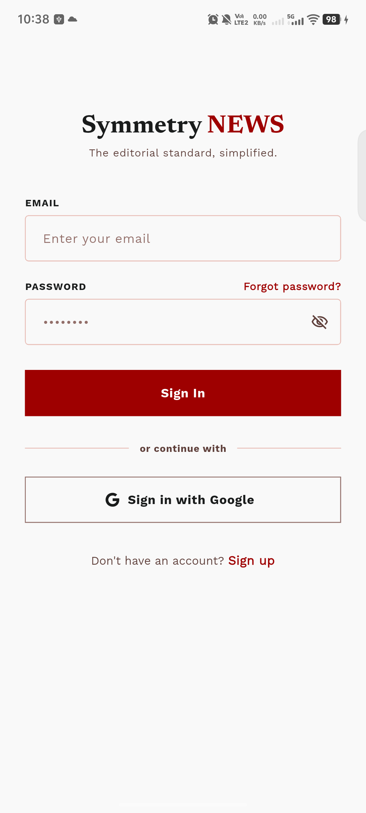 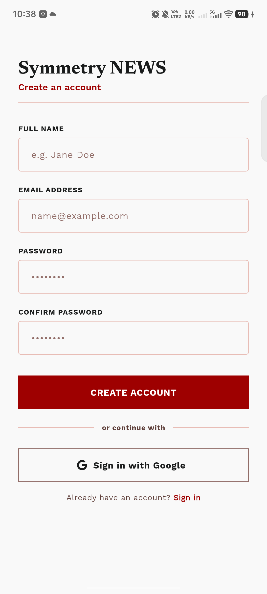                                                                                                                  |
| User profile               | 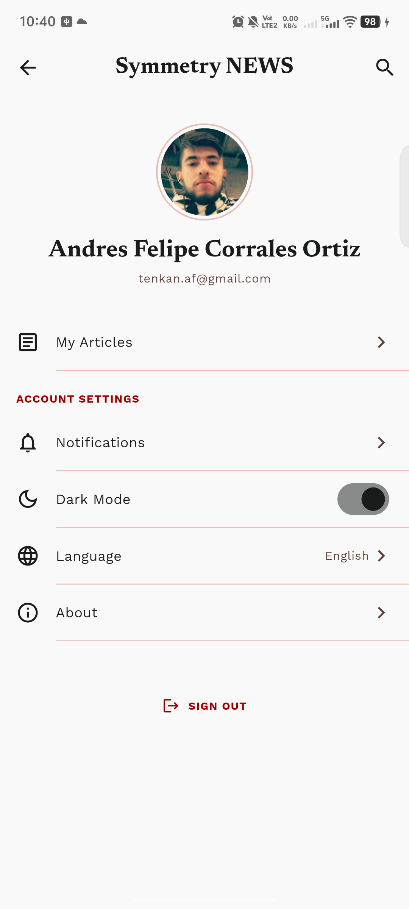                                                                                                                                                                                                                                               |
| News feed and search       | 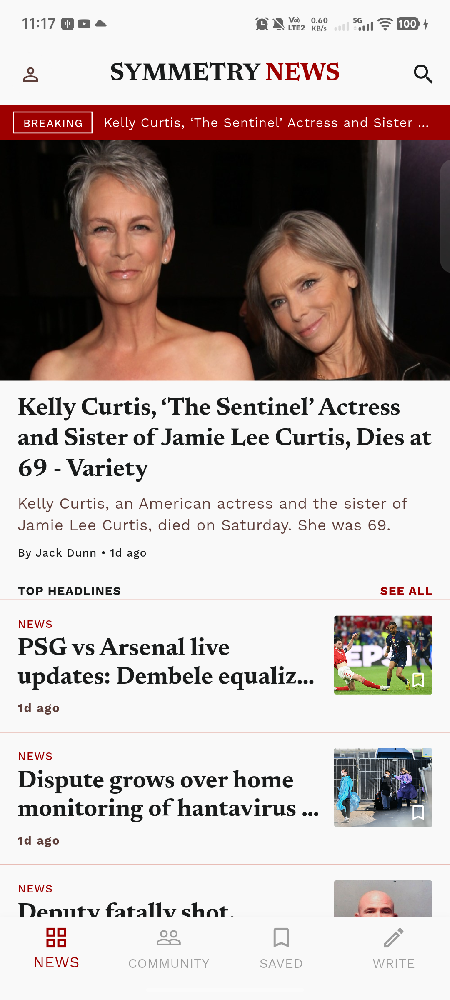 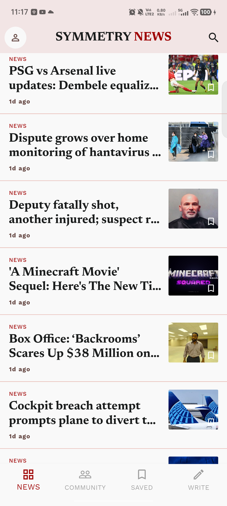 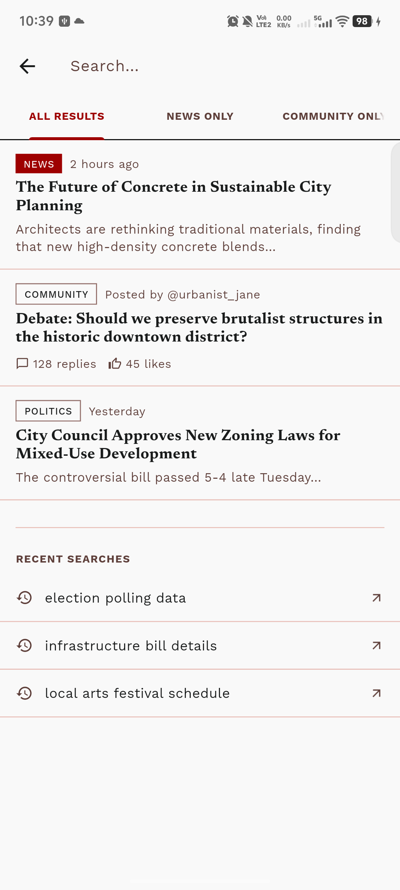                                                                                                              |
| News detail                |  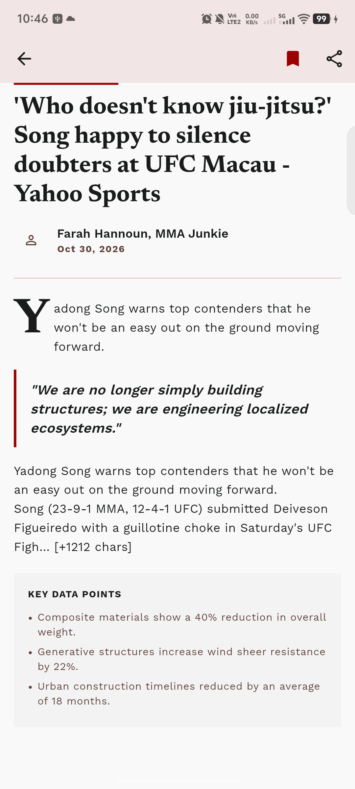                                                                                                                                                   |
| Bookmarks                  | 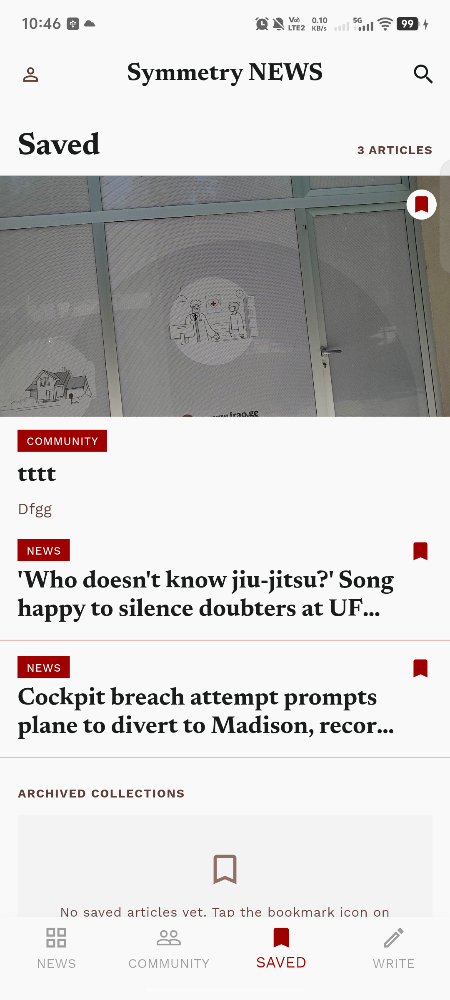 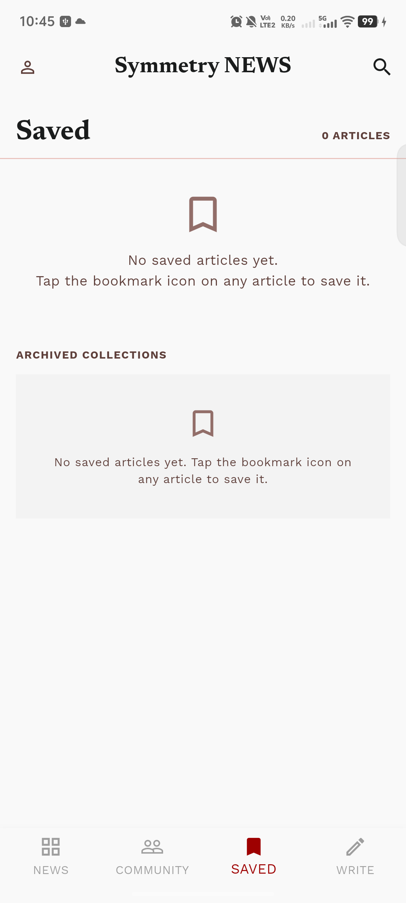                                                                                                                                                                                   |
| Community article editor   | 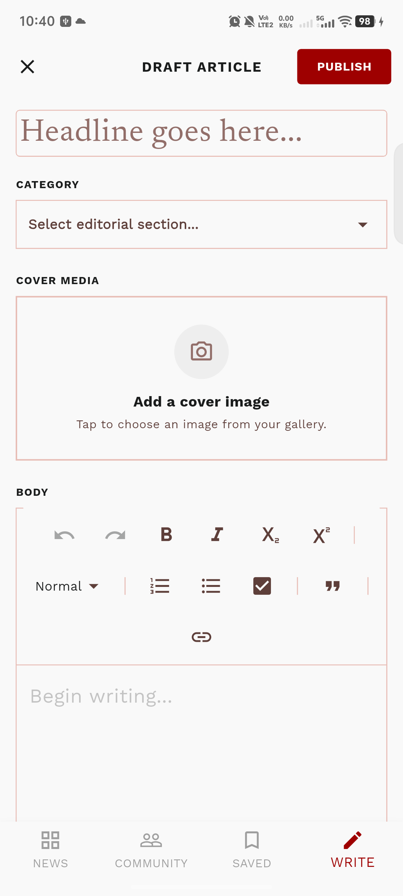 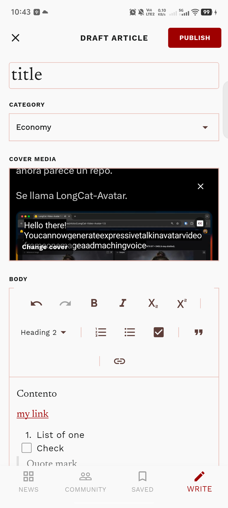 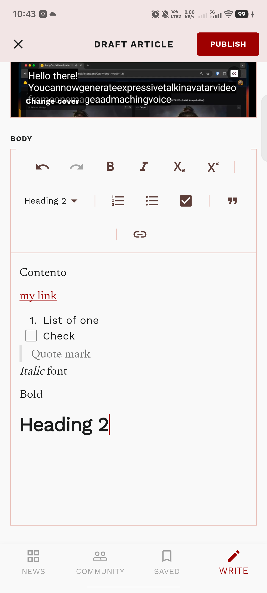                                          |
| Community article detail   | 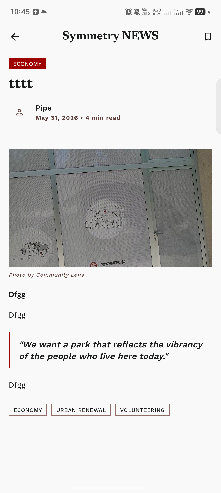 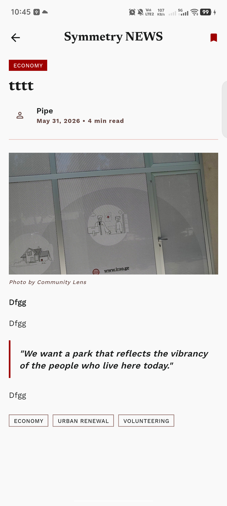                                                                                                                           |
| Community owner actions    | 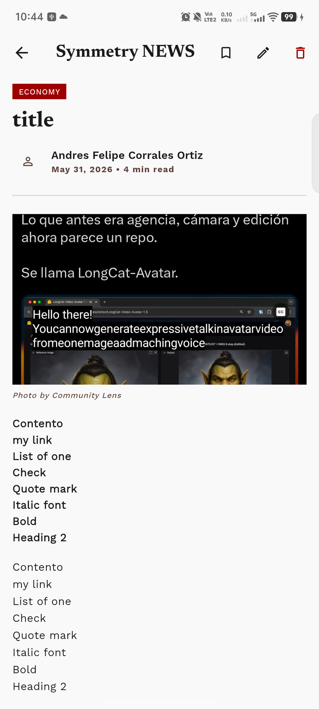 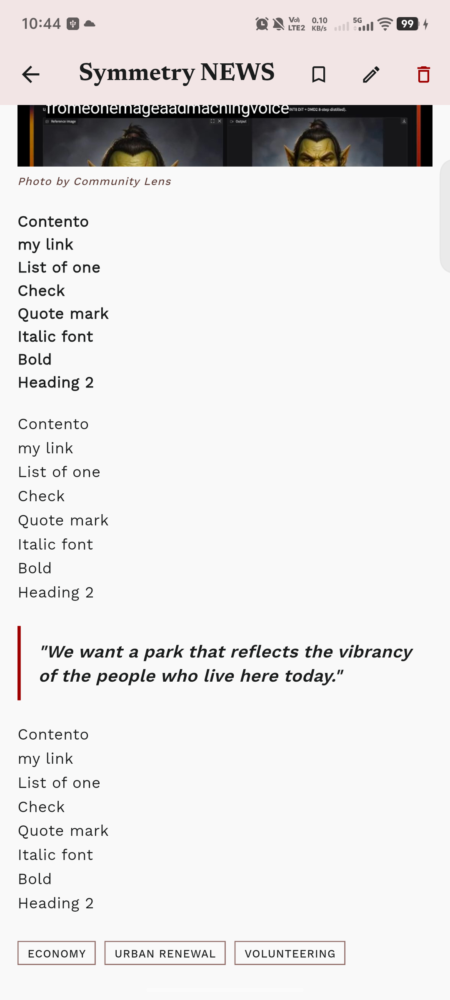 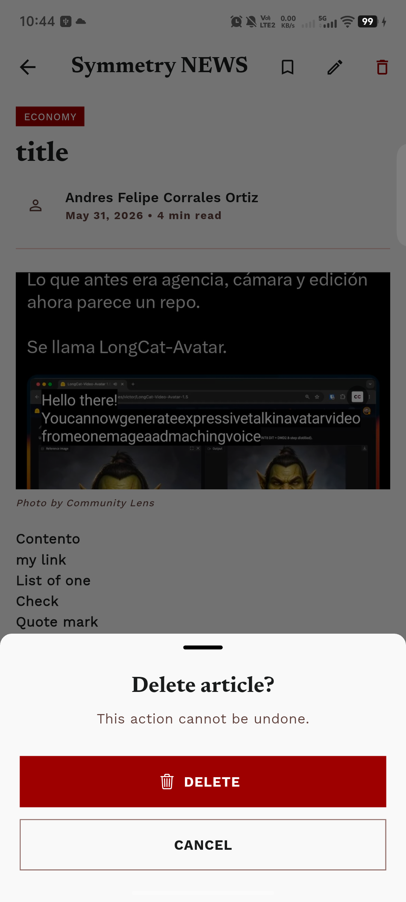 |

## 6. Overdelivery

### Dependency and Platform Modernization

I updated the project dependencies so the app is compatible with Dart SDK `^3.11.1` and Flutter `3.41.4`. I also regenerated the Android project folder for compatibility with current Flutter tooling and added improvements intended to make Android builds more efficient.

### Conventional Commits

I adopted [Conventional Commits](https://www.conventionalcommits.org/en/v1.0.0/) to keep commit messages consistent and easier to review. This makes project history more useful because each commit communicates whether it is a feature, fix, refactor, test, or documentation change.

### Drift Local Database

I added Drift and removed Floor because Floor was obsolete for the updated stack. Drift now supports the local persistence layer used by bookmarks while keeping database access isolated in the data layer.

### API Pagination

I added pagination to API-driven data so the app can load news progressively instead of treating the feed as a single static request. This improves scalability and gives the UI a better foundation for larger article lists.

### BBC News-Inspired Design

The visual direction was inspired by BBC News and the provided Stitch reference: <https://stitch.withgoogle.com/projects/12664588024234900421>. The goal was to make the app feel more editorial, structured, and recognizable as a news experience.

### Design System, Widget Tests, and Previews

I added a reusable design system with shared widgets, widget tests, and Flutter widget previews. This makes UI components easier to inspect, reuse, and validate independently from full app flows.

### Localization With `gen-l10n`

Localization was added through Flutter's generated localization workflow. The project uses `flutter generate: true` and `l10n.yaml` to generate localization code from ARB files, making localized strings safer and easier to maintain.

### Advanced Localized Error Handling

The app includes more exhaustive error handling with localized messages. This helps users understand what went wrong while avoiding hardcoded strings scattered throughout the UI.

### Advanced Modular Routing

Routing was improved with modular route definitions, auth guards, shell navigation, and preserved redirect intent. This keeps navigation behavior organized and makes protected routes easier to reason about.

### Authentication and Form Validation

The app supports email authentication and Google authentication. Login and registration flows include form validation, and authenticated screens can render user-specific information.

### Hooks for Widget Optimization

I used `flutter_hooks` in several presentation widgets to manage controllers, side effects, and lifecycle behavior more cleanly. This helps reduce unnecessary rebuild complexity and keeps stateful UI logic easier to follow.

### Bookmarks Test Coverage

The bookmarks feature includes integration, unit, and widget tests. This validates behavior across the local persistence layer, domain use cases, bloc state management, and saved article UI.

### User Profile Screen

The profile screen displays data from the authenticated user, including account details such as name, email, and profile image when available. This makes authentication visible and useful beyond simply granting access.

### Community Articles

Users can create and edit community articles. Community article data is stored in Firestore, and article images are stored in Firebase Storage. This follows the backend schema where Firestore stores article metadata and Firebase Storage stores uploaded images under `community_article_images/{userId}/...`.

## 7. Extra Sections

### Technical Summary

| Area              | Result                                                     |
| ----------------- | ---------------------------------------------------------- |
| SDK compatibility | Updated for Dart SDK `^3.11.1` and Flutter `3.41.4`        |
| Commit style      | Adopted Conventional Commits                               |
| Android platform  | Regenerated Android folder and improved build performance  |
| Local database    | Replaced Floor with Drift                                  |
| API data          | Added pagination                                           |
| UI direction      | BBC News-inspired editorial design                         |
| Design system     | Added reusable widgets, widget tests, and previews         |
| Localization      | Added Flutter `gen-l10n` workflow                          |
| Errors            | Added advanced localized error handling                    |
| Routing           | Added modular routing and auth guards                      |
| Authentication    | Added email and Google authentication with validation      |
| Performance       | Used hooks and Android build improvements                  |
| Testing           | Added integration, unit, and widget coverage for bookmarks |
| Profile           | Added authenticated user profile display                   |
| Community content | Added community article creation and editing               |

### Project References

- [Report instructions](./REPORT_INSTRUCTIONS.md)
- [Application architecture](./APP_ARCHITECTURE.md)
- [Architecture violations](./ARCHITECTURE_VIOLATIONS.md)
- [Coding guidelines](./CODING_GUIDELINES.md)
- [Contribution guidelines](./CONTRIBUTION_GUIDELINES.md)
- [Database schema](../backend/docs/DB_SCHEMA.md)
